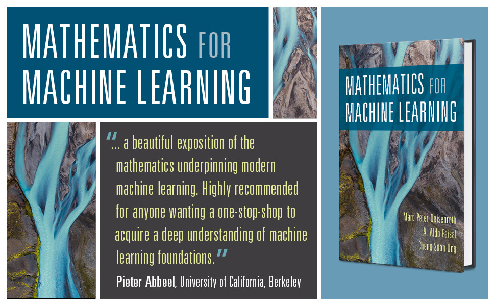

안녕하세요, 저는 수학공부방 Season1 - Math for ML 스터디의 빌더 [박진호](www.linkedin.com/in/jinho-park-9010)입니다! 저는 그동안 가짜연구소에서 컴퓨터비전과 금융공학 그리고 DSF와 연계한 Python Developer/Machine Learning Scientist Career track 스터디를 참여/운영해 왔습니다. 가짜연구소에서 빌더 활동을 시작하면서 생각했던 "한가지에 몰두하기보단 다양한 주제를 가지고 공부해보자"라는 다짐을 지키기 위해서 오늘도 노력하고 있습니다:D  
이 포스트에서는 2024년 상반기에 진행될 **수학공부방 Season1 - Math for ML** 스터디에 대해서 간단히 소개하려고 합니다.

## 수학공부방 Season1 - Math for ML 스터디 소개

  
이번 스터디에서는 **Mathematics for Machine Learning**(저자 - Marc Peter Deisenroth, A. Aldo Faisal, and Cheng Soon Ong)이라는 책을 함께 공부하고자 합니다.
이 책은 크게 두가지 파트로 구성되어 있는데 아래와 같습니다.
>1) 머신러닝 학습에 필요한 다양한 수학이론 (선형대수, 해석기하, 미적분학, 확률통계, 최적화)
>2) 앞에서 배운 수학적 지식들이 활용된 머신러닝 알고리즘 (Linear Regression, PCA, GMM, SVM)

이 중에서 이번 Season1에서는 1)의 머신러닝에 필요한 **수학이론을 학습하는 것에 집중**합니다.

다만 지금까지 제가 운영해왔던 스터디들과는 다르게 수학공부방은 **지적유희**에 초점을 맞춰서 운영하려고 합니다.  
아마 머신러닝 또는 인공지능 알고리즘을 학습하기 위해서 수학공부를 해보셨던 많은 분들은 수학 그 자체에 집중하기보다는 알고리즘을 이해하기 위해 필요한 최소한의 내용만을 학습하고 다시 알고리즘 학습으로 복귀하는 방식을 선택하셨을 것이라 생각됩니다. 목표가 머신러닝, 인공지능에 있다보니 수학은 그것을 위한 도구로 생각하고 최대한 효율적으로 학습하는것이 좋으니까요.

생각해보니 학교를 졸업하고 나서는 수학 자체를 깊에 공부할 기회가 거의 없었는데 "한 번 쯤은 수학 자체를 목표로 스터디를 진행해도 재미있지 않을까?", "이런 욕구를 가지고 있는 분들이 어딘가에 있지는 않을까?"라는 생각이 들었고 지금의 스터디를 빌딩하기에 이르렀습니다. 누군가는 쏟아지는 머신러닝, 인공지능 논문을 볼 시간도 없는데 수학공부만 하는 스터디에 참여해도 될까?라는 걱정을 할수도 있고 저도 어느정도는 공감을 합니다.  
그래서 이번 스터디의 주된 테마는 **지적유희**로 결정한 것입니다. 이번 스터디는 다음과 같은 특징들을 갖습니다.

- 빌더가 페이지 분량을 고려한 주차별 진도량, 학습목표가 있지만 이것은 실제 스터디 진도에 따라서 가변적으로 조절된다. (진도나가는 것에 목숨걸지 않는다)
- 매주 진행되는 스터디에 참여하는 구성원들은 책에 있는 내용의 완벽한 이해를 목표로 한다. (이해를 위해서라면 진도를 포기할 수 있다, 부족한 부분은 season2에서 하면 된다)
- 수학 이론들을 이해하는것 자체에서 재미를 추구한다.

다만 수학을 공부하는것 자체는 좋아하지만 그렇다고 너무 자신의 연구주제(이 글을 보는 대부분은 머신러닝, 인공지능 분야일것이라 추측합니다)와 동떨어진 것들을 배우는것은 좀 그렇다...라고 생각할수도 있는데, 이런 상황에 딱 알맞은 교재가 있으니 그게 바로 [**Mathematics for Machine Learning**](https://mml-book.github.io/)입니다.  
감사하게도 교재와 교재의 내용에 대한 코드구현, 튜토리얼도 무료로 온라인상에 공개되어 있기때문에 저희는 열심히 공부만 하면 됩니다. 이 포스팅을 빌어 저자분들에게 무수한 감사와 존경을 보냅니다:D

## 빌더 소개

저는 컴퓨터비전과 인공지능 그리고 자율주행에 대해서 연구를 하고 있는 [박진호](www.linkedin.com/in/jinho-park-9010)입니다.  
최근에는 라벨링 없이 학습이 가능한 Unsupervised/Self-supervised Learning 분야에 대해서 더 깊에 공부하고 있습니다:D 빠르게 변화하는 분야인 만큼 늘 공부해야 할 것들이 쌓여가지만 혼자서는 도무지 진도를 나가는게 쉽지 않아서(천성이 놀고 뒹굴거리는 것을 좋아해서ㅜㅜ) 가짜연구소에서 스터디를 운영하게 되었습니다.  

지금까지 운영했던 스터디들중 일부 페이지를 소개합니다!!
>📷[Computer Vision - Part1](https://pseudo-lab.com/chanrankim/Computer-Vision-Part1-c8c9fe2978b34f13b06aad58d33b9ef3)  
>📸[Computer Vision - Part2](https://pseudo-lab.com/chanrankim/Computer-Vision-Part2-6f0ee01150d2468495dfa0511e6faee8)  
>🐍[Datacamp Intensive Study - Python Programmer Track](https://pseudo-lab.com/chanrankim/Datacamp-Intensive-Study-Python-Programmer-Track-a73fd61c8f54483dafb1a3d3ebf74454)

## 프로젝트 계획

- 수학공부방 스터디는 매주 화요일 오후 9시 가짜연구소 디스코드 채널에서 진행됩니다.
- OT를 진행할때 주차별 발표자를 사다리 타기를 통해서 선정합니다.
- 모든 스터디 구성원들은 정해진 분량만큼 교재의 내용을 학습하고 스터디에 참여합니다.
- 발표자는 학습한 내용에 대해 본인이 이해한 것을 강사의 입장에서 설명합니다. 단, 단순하게 내용전달 위주로 진행하기보다는 구성원들과 토론식으로 스터디를 진행해보려고 합니다.
- 스터디 시간은 최대 2시간이며, 2시간을 넘어갈 경우 남은 분량은 다음주에 이어서 진행합니다.
- 비정기적인 오프라인 모임(치맥, 피맥)을 통해 구성원들간의 네크워킹 진행

## 주차별 목표

주차별 학습 분량은 [계획표](https://www.notion.so/chanrankim/Season1-Math-for-ML-acff3b9250334dd4a51b0f95716a574d)를 참고해주세요!
우선 제가 임의로 분량을 나눴는데 매주 약 20페이지를 학습한다고 생각하시면 됩니다.
 
다만, 앞서 설명드렸던 것처럼 매주 분량을 칼같이 지키면서 진도를 나가는것보다는 내용의 완벽한 이해를 더 중요하게 생각하는 스터디라는 점을 꼭 명심해주세요!!!

머신러닝과 수학공부에 관심이 있는 많은 분들이 함께하기를 기대하겠습니다!!!

